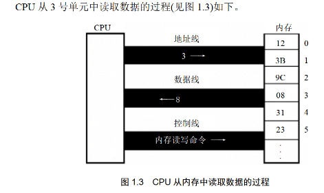
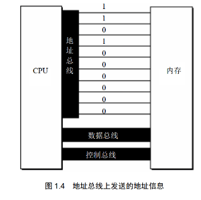
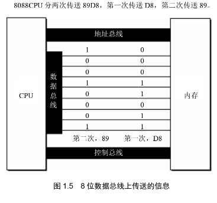
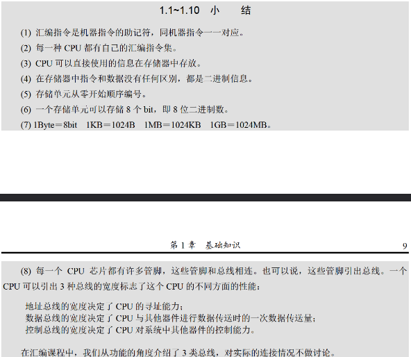
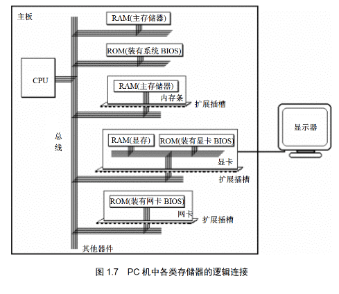
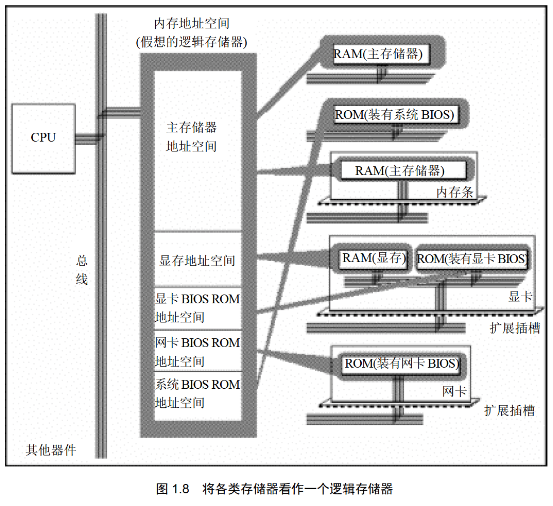
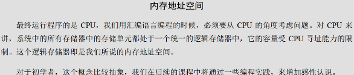

# 1 基础知识

> 一些基础知识


### 1.1 机器语言

> 机器语言是一种只包含”0“和”1“的语言,难于辨别记忆

****

```machine languege
10101011
10101000
00011101
11010101
10101010
```

大概就是这个样子

于是,发明了汇编语言


### 1.2 汇编语言的发展

> 汇编语言主体是汇编指令,与机器指令差别在于表示方法,汇编指令较机器语言便于记忆

****

汇编指令是机器指令**便于记忆**的书写格式

```assembly
mov ax,bx
; 将bx的内容送到ax中
```

但计算机只能读懂**机器码**

将汇编指令转化为机器指令的程序,称其为**编译器**


### 1.3 汇编语言的组成

> 汇编语言的核心是**汇编指令**，它决定了汇编语言的**特性**

***

汇编语言有以下三类指令组成

- 汇编指令：机器码的助记符，有对应的机器吗
- 伪指令：没有对应的机器码，由编译器执行，计算机并不执行
- 其他符号：如 *+、-、、/* 等，由编译器识别，没有对应的机器码


### 1.4 存储器

> CPU工作所需的**指令和数据**在**存储器**中存放

***

CPU工作需要**指令和数据**，而这些**指令和数据**在**存储器**中存放，也就是平时所说的**内存**

磁盘不同与内存,磁盘要先读到内存中才能被CPU使用

要灵活地利用汇编语言编程,我们要了解CPU如何从内存中**读写信息**


### 1.5 指令和数据

> 指令和数据是**应用**上的概念,都是**二进制信息**,根据**情景**赋予其**不同的含义**


### 1.6 存储单元

> 存储器被划分为若干个储存单元(编号从0开始),微机储存其的储存单元可以储存一个Byte

***

B,KB,MB,GB,TB

以上是微机中常用的计量单位，进制1024

磁盘容量单位同内存


### 1.7 CPU对存储器的读写

> CPU对存储器读写需要**地址信息**、**控制信息**、**数据信息**

***

CPU要对读写内存，要先确定地址，还要指明对哪一个器件进行哪种操作，是读是写

可见CPU要想进行数据的读写必须和芯片进行下面3类信息交互

- 存储单元的地址（地址信息）
- 器件的选择，读或写的命令（控制信息）
- 读或写的数据（数据信息）

CPU通过**导线**来传递信息（电信号）

而CPU和其他芯片的导线通常成为**总线**（从物理上说，就是一根根**导线的集合**）

根据**传递信息**不同，总线从逻辑上分为3类

- 地址总线（发出地址信息）
- 控制总线（发出读写命令，选中存储器芯片并通知要对其1读写）
- 数据总线（读写信息）




### 1.8 地址总线

> CPU通过**地址总线**寻址，地址总线上能传递不同信息的个数便为CPU能进行寻址的存储单元的个数

***

一个CPU有N根**地址导线**,这个CPU**地址总线**的**宽度**为N

这样的CPU最多可以寻找**2^N(0~2^N-1)**个内存单元




### 1.9 数据总线

> CPU与其他器件的**数据传送**通过数据总线进行

****

数据总线的**宽度**决定了**数据传送速度**

N根数据总线一次可传送一个N位二进制数据（即N/8个字节）




### 1.10 控制总线

> CPU对外部器件的控制通过**控制总线**进行(此处控制总线是**总称**,是不同控制线的集合)

***

多少根控制总线意味着CPU提供了对外部器件的多少种控制

(例:内存读的命令便由负责"读信号输出"的控制线由CPU向外传递"读信号")

控制总线的**宽度**决定了CPU对外部器件的控制能力




### 1.11 内存地址空间(概述)

> CPU**可寻到的内存单元**构成这个CPU的内存地址空间
>
> (例如:1个CPU地址总线宽度10,这个CPU的内存地址空间就是它能寻到的1024个内存单元)


### 1.12 主板

> 每一台PC上都有一个**主板**，主板上有**核心器件**和**主要器件**


### 1.13 接口卡

> CPU对外部设备(如显示器、音箱、打印机等)不能直接控制,通过接口卡控制外设进行工作

***

CPU对外部设备(如显示器、音箱、打印机等)不能直接控制

直接控制这些设备的是插在扩展插槽上的**接口卡**

扩展插槽通过总线和CPU相连，所以接口卡也通过总线同CPU相连

CPU可以直接控制这些接口卡，从而实现对外部的控制


### 1.14 各类存储器芯片

> 一台PC中装有多个存储器新品，从物理连接上看它们是独立、不同的器件

***

读写上看各类存储器芯片分为2类:
随机存储器(RAM) 和 只读存储器(ROM)

随机存储器**可读可写,关机消失**

只读存储器**关机不消失，只能读取不能写入**


这些存储器从**功能和连接**上又能分为以下几类

- 随机存储器(可读可写,关机消失)
- 装有BIOS(基本输入/输出系统)的ROM(主板和各类接口卡厂商提供的软件系统)
- 接口卡上的RAM(一些需要大批量输入、输出数据的接口卡 如显存)




### 1.15 内存地址空间

> 存储器在物理上独立，但CPU在操控它们时把它们当作**内存**看待

***

存储器在**物理上独立**，但都有两点**共性**

- 都和CPU总线相连
- CPU对它们读写时都通过控制线发出**内存读写命令**

CPU在操纵它们时，把它们总的视作一个由若干存储单元组成的逻辑存储器（内存地址空间）



在图1.8中,所有物理存储器被视作一个由若干存储单元组成的**逻辑存储器**(内存地址空间)

每个物理存储器在这个逻辑存储器中占有一个内存段，即一段**地址空间**

CPU在这段地址空间读写数据，实际上就是在**相应物理存储器**中读写数据


不同的计算机系统内存地址空间分配也是不同的

