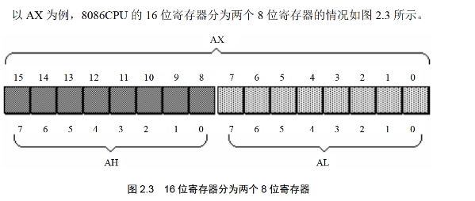
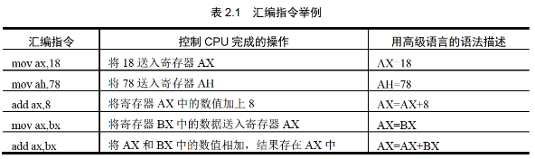
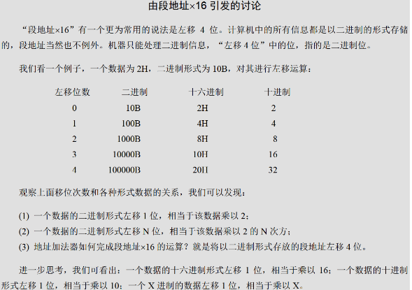
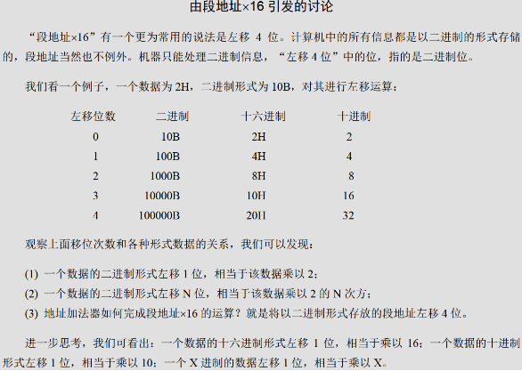
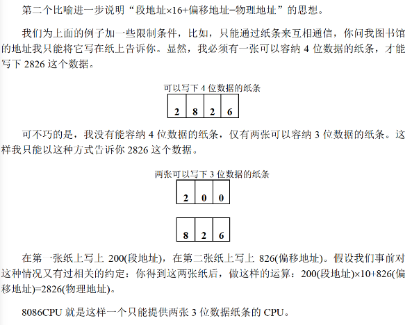
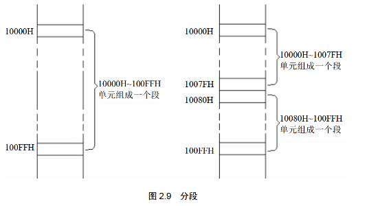
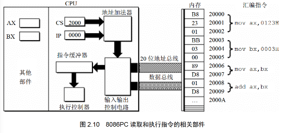
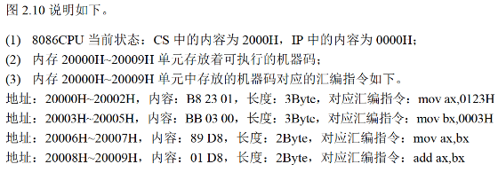
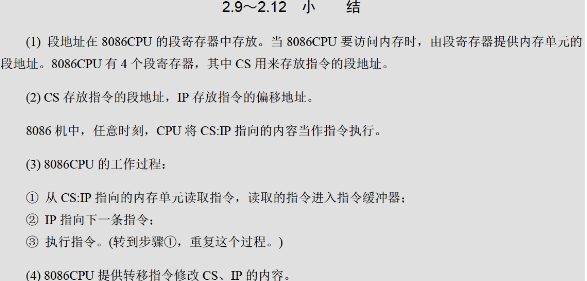

# 2 寄存器

> 内部总线实现CPU内部各个器件之间的联系。对于汇编程序员来说，CPU主要部件是**寄存器**。
> 
> 程序员可以用**指令**读写寄存器，通过改变寄存器的内容来实现对CPU的控制
> 
> 不同CPU寄存器**个数结构**不同


### 2.1 通用寄存器

> 用于存放**一般性的数据**的寄存器,被称为**通用寄存器**

****
8086CPU(16位寄存器)上一代的CPU寄存器是8位,  
为了确保**兼容**,8086CPU的AX BX CX DX这4个通用寄存器  
可分为两个可独立使用的8位寄存器来用
   
如图,AX的**低8位**构成AL寄存器,**高8位**构成AH寄存器


### 2.2 字在寄存器中的存储
> 字的**高位字节**存放在**高8位寄存器**,**低位字节**存放在**低8位**寄存器
****
字:记为*word*,一般由**两个字节**组成


### 2.3 几条汇编指令
> 汇编指令或寄存器名称**不区分大小写**

****
如下,几条汇编指令

```assembly
mov ax,bx
; 将bx的内容送到ax中 
; mov ax,bx ax = bx
add ax,bx
; 将ax和bx中的数值相加,结果存在ax中
; add ax,bx ax = ax + bx(ax += bx)
```

> 注：对于**寄存器**存放不下的数据，会舍去其**高位**，从最高位开始，依次往下舍去


### 2.4 物理地址

> 所有内存单元构成的存储空间是个**一维的线性空间**(数组)
>
> 每个内存单元在这个空间中有唯一的地址,将这个唯一的地址称为**物理地址**

****

CPU通过那个地址总线送入存储器的，必须是一个内存单元的**物理地址**

在CPU向地址总线发出物理地址之前，必须要在内部先**形成**这个物理地址

不同CPU形成物理地址方式不同


### 2.5 16位结构的CPU

> 16位结构的CPU 一次性处理、运输、暂时存储的信息最大长度为16位

****

16位结构的CPU具有以下几方面的结构特性

- 运算器一次最多可以处理16位的数据
- 寄存器的最大宽度为16位
- 寄存器和运算器之间的通路(总线)宽度为16位


### 2.6 8086CPU 给出物理地址的方法

> 8086CPU 为16位结构，地址总线为20位。其使用两个16位地址来形成一个20位的物理地址

****

段地址*16+偏移地址 = 物理地址   

左移将高位移动,在末尾用0填充   
X进制的数据左移N位,相当与乘X^N


### 2.7 "段地址×16+偏移地址=物理地址"的本质含义

> 本质含义：CPU在访问内存时,用基础地址(段地址×16)加上相对应的偏移地址的出物理地址

****

举个例子来理解:

对于A地的访问,有两种方法

1. 从B地走1000米到达,这1000米可以认为是A地的物理地址
2. 从B地走700米到达C地(相对于起点的基础地址),再从C地走300米到达(以基础地址为起点，想对于基础地址的偏移地址)

在**某种限制**下，我们可以通过**相关的约定**作出运算得到我们需要的



### 2.8 段的概念

> 内存并没有分段，段的划分来自与CPU

****

由于CPU计算出物理地址的方式,使得我们可以分段来管理内存


如图,10000H和100FFH视为一段,这一段大小为100(其间有100个单元)

该段起始位置为10000H, 段地址即为1000H(×16),偏移地址为0000H-00FFH

通过**偏移地址**来定位具体是这一段中的哪个内存单元

可以根据需要,将**地址连续**、**起始地址为16的倍数**的一组内存单元定义为一个段


### 2.9 段寄存器

> 段地址在段寄存器中存放


### 2.10 CS和IP

> CS和IP为8086CPU中两个最关键的寄存器
>
> CS为代码段寄存器,IP为指令指针寄存器

****

在8086PC机中,任何时刻设CS内容为M,IP内容为N

8086CPU将从内存M×16+N单元开始读取指令并执行



步骤约如下:

1. 初始状态 准备执行
2. CS、IP内容送入地址加法器
3. 地址加法器将物理地址送入输入输出控制电路
4. 输入输出控制电路将**物理地址**送上地址总线
5. 从物理地址起始单元开始存放的机器指令通过**数据总线**送入CPU
6. 输入输出控制电路将机器指令送入指令缓冲器
7. IP中的值(偏移地址)自动增加以使读取下一条指令,增加的值为此次执行指令的长度,增加到下一条指令开头

段地址:偏移地址也可表示物理地址


### 2.11 修改CS、IP的指令

> [如2.10](#2.10 CS和IP),修改CS、IP的值可以来控制CPU执行目标指令
>
> 能够设置CS、IP内容的指令被统称为**转移指令**

****

介绍一个最简单的转移指令:jmp指令

若想同时修改CS、IP的内容 

可用形如"jmp 段地址:偏移地址"的指令完成(段地址修改CS,偏移地址修改IP),如

```assembly
jmp 2AE3:3
; CS=2AE3H IP=0003H CPU将从2AE3H*16+0003H=2AE33H处读取指令
```

仅想修改IP的内容,使用"jmp 某一合法寄存器"来使用寄存器的值修改IP

```assembly
jmp ax
; mov IP,ax
```


### 2.12 代码段

> 可以将一组地址连续、起始地址为16倍数的内存单元视为存放代码的代码段

****

使代码段指令被执行,要将CS:IP指向代码段的**第一条指令的首地址**

如视 存放123B0H~123B9H的一组内存单元 为代码段(段地址为123B0H,长度为10个字节)

要想让这段代码得到执行,可设CS=123BH,IP=0000H




