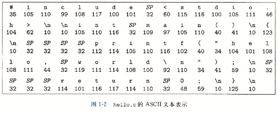
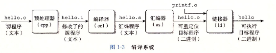
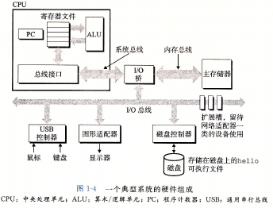
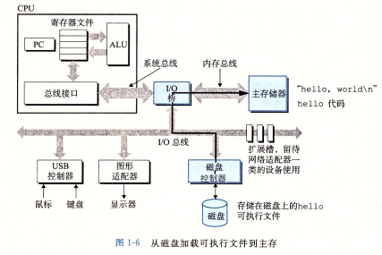
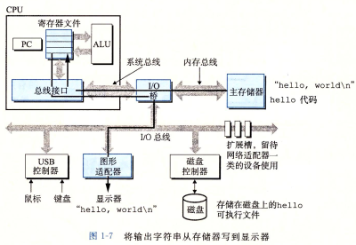

# 1 计算机系统漫游

```c
#include <stdio.h>

int main() {
  printf("Hello World!\n");
  return 0;
}
// hello 程序
```


### 1.1 信息就是位+上下文

> 系统中所有信息都是由**一串bit**表示,区分不同数据对象的唯一方法是这些数据对象的**上下文**

****

hello程序的生命周期由一个*源程序*(*源文件*)开始,源程序实际上就是一个由值 **0**和**1**组成的位(bit)序列

8个bit为1字节

ASCII标准:用唯一的**单字节大小**的**整数值**表示每个字符 如:100表示d



*像hello.c这样只由**ASCII字符**构成的文件称为**文本文件**,所有其他文件都称为**二进制文件***

hello.c 的表示方法说明了一个基本思想:

系统中所有信息都是由**一串bit**表示,区分不同数据对象的唯一方法是这些数据对象的**上下文**


### 1.2 程序被其他程序翻译成不同的格式

> 为了在系统上运行高级语言程序,高级语言程序被其他程序转化为一系列的低级机器语言指令

****

hello程序的生命周期从一个高级C语言程序开始,这种形式能被人读懂

为了在系统上运行hello.c程序,每条C语句都必须被其他程序转化为一系列的低级**机器语言**,然后这条指令按照一种成为**可执行目标程序**(**可执行目标文件**)的格式打好包,并以二进制磁盘文件的形式存放起来

在Unix系统上,从源文件到目标文件的转化是由**编译器驱动程序**完成的:

```bash
linux> gcc -o hello hello.c
```

GCC编译器驱动程序读取源程序文件hello.c,并把它翻译成一个可执行目标文件hello

这个负担一过程可分为四个阶段,执行这四个阶段的程序(预编译器、编译器、汇编器和链接器)一起构成了**编译系统**



- #### 预处理阶段

​		预处理器(cpp)根据以字符*#*开头的命令修改原始的C程序,通常以.i作为文件扩展名

- #### 编译阶段

​		编译器(ccl)将文本文件.i翻译成文本文件.s(*汇编语言程序*)

​		(**汇编语言**为不同高级语言不同编译器提供了**通用的输出语言**)

- #### 汇编阶段

  汇编器(as)将.s翻译成机器语言指令,打包成一种叫做**可重定位目标程序**的格式,并将结果保存在目标文件.o中

- #### 链接阶段

​		请注意,hello程序调用了printf()函数,printf()函数存在于一个名为printf.o的单独的预编译好了的目标文件,链接器(ld)负责将这个文件合并到hello.o程序,结果得到hello文件,一个**可执行目标文件**(**可执行文件**)


### 1.3 了解编译系统如何工作是大有益处的

> 原因:**优化程序性能**、**理解链接时出现的错误**、**避免安全漏洞**

****

对于简单程序,可以依靠编译系统生成正确有效的机器代码

但是有一些重要的原因促使程序员必须知道编译系统是**如何工作**的:

- **优化程序性能**
- **理解链接时出现的错误**
- **避免安全漏洞**


### 1.4 处理器读并解释储存在内存中的指令

> 

****

```bash
linux❯ ./hello
Hello World!
```

要想在Unix系统上运行hello可执行文件,我们将它的文件名输入到称为shell的应用程序


#### 1.4.1 系统的硬件组成

> 系统的一些硬件

****

 为了理解运行hello程序时发生了什么,我们需要了解一个典型系统的硬件知识

1. **总线**

​	贯穿整个系统的是一组电子管道(导线),称为**总线**。它通常被设计为传送定长的字节块,也就是**字**

2. **I/O设备**

​	I/O(输入/输出)设备是系统与外部世界的联系通道。每个I/O设备都通过一个**控制器**或**适配器**与**I/O总线**相连



3. **主存**

​		主存是一个**临时存储设备**,用来存放程序和程序处理的数据

​		物理上来说,是一组**动态随机存取存储器**;逻辑上来说,是一个**线性的字节数组**

4. **处理器**

   **中央处理单元**(CPU),简称处理器,是解释(执行)存储在主存中指令的引擎

   核心是一个大小为**一个字**的存储设备(寄存器 CS:IP),称为**程序计数器**(PC),指向要执行的机器语言指令(含有该条指令的地址)

从系统通电到断电,CPU一直不断执行程序计数器指向的指令再更新程序计数器,使其指向下一个指令

看上去是按照一个非常简单的**指令执行模型**来操作的,这个模型由**指令集架构**决定


### 1.4.2 运行hello程序

> 

****

- 初始,shell执行指令等待我们输入命令

  当我们输入"./hello"后,shell程序将字符**逐一读入寄存器**再把它存放到**内存**中

- 按回车键时,shell执行指令加载可执行的hello文件,将hello目标文件中的代码和数据从**磁盘**复制到**主存**,数据包括最后会被输出的字符串"hello,world\n"

  利用***直接存储器存取***(DMA)技术,数据可以不通过中央处理器而直接从磁盘到达主存,步骤如图1-6所示

  

- hello中的代码和数据被加载到主存,物理地址被定位到hello程序的main函数,处理器开始执行hello程序的main程序中的机器语言指令,如图1-7所示

  